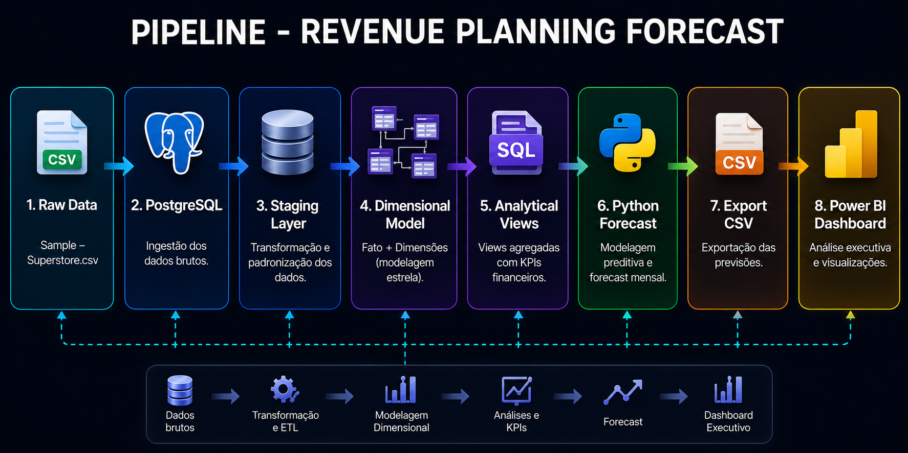
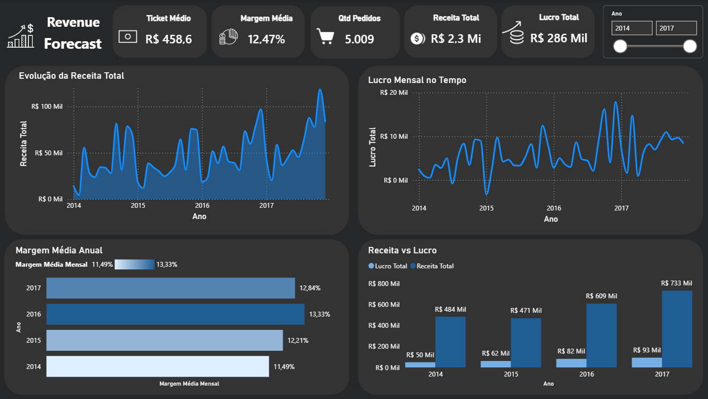
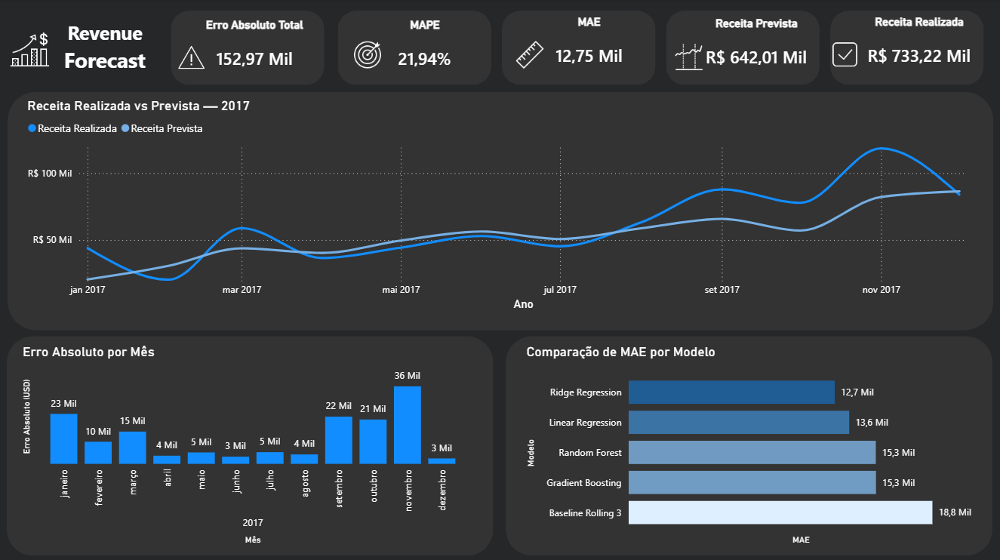

# Revenue Forecast — End-to-End Pipeline

## Sobre o projeto

Projeto de Revenue Planning construído para simular uma esteira completa de dados aplicada à previsão e análise de receita. O objetivo foi estruturar dados transacionais, construir uma base analítica confiável, desenvolver um modelo preditivo de receita mensal e entregar os resultados em dashboard executivo.

A solução conecta SQL, Python e Power BI em um pipeline que vai do dado bruto à decisão de negócio.

---

## Problema de negócio

Ausência de visibilidade consolidada de receita mensal, com planejamento financeiro dependente de análises manuais e reativas. O desafio foi transformar dados transacionais dispersos em uma base analítica estruturada, confiável e com capacidade preditiva para apoiar decisões de orçamento, metas e fluxo de caixa.

---

## Arquitetura da solução



---

## Stack

- **SQL / PostgreSQL** — modelagem dimensional, staging, views analíticas
- **Python** — pandas, scikit-learn, matplotlib, numpy, psycopg2
- **Power BI** — dashboard executivo de Revenue Planning

---

## Etapas do projeto

### SQL — Modelagem e estruturação

- Camada raw preservando o dado original
- Staging com padronização de tipos, datas e campos derivados
- Modelo dimensional com dimensões de cliente, produto, localização, envio e calendário
- Tabela fato de vendas com chaves estrangeiras e métricas financeiras
- Views analíticas de receita mensal, segmento, categoria, região e base de forecast

### Python — Forecast

- Conexão com PostgreSQL e carregamento da base mensal
- Validação temporal da série histórica
- Criação de features: time_index, quarter, is_year_end, revenue_lag_1, revenue_rolling_3
- Split temporal: treino 2014-04 a 2016-12 / teste 2017-01 a 2017-12
- Modelos testados: Baseline Rolling 3, Linear Regression, Ridge Regression, Random Forest, Gradient Boosting
- Melhor modelo: Ridge Regression

### Power BI — Dashboard executivo

**Revenue Overview:** receita total, lucro total, margem média, ticket médio, pedidos, evolução temporal, margem anual e comparativo receita vs lucro.

**Forecast Analysis:** MAPE, MAE, erro absoluto total, receita realizada vs prevista, erro por mês e comparação de MAE por modelo.




---

## Dashboard Online

O dashboard completo também pode ser acessado online pelo Power BI Service:

[Access Power BI Dashboard](https://app.powerbi.com/view?r=eyJrIjoiOGNlZjQ1NDctYmI0MS00NzNkLWE1YzYtMWNlYWU5YjI5ODc0IiwidCI6IjhkZmU1ZmEyLTYwMWEtNDk2Ny1hNGI0LWM4YWY4NjFlZjNmMSJ9)

---

## Resultados do modelo

| Modelo | MAE | RMSE | MAPE |
|---|---|---|---|
| Ridge Regression | 12.747 | 16.407 | 21,94% |
| Linear Regression | 13.641 | 17.519 | 22,11% |
| Random Forest | 15.287 | 18.082 | 26,47% |
| Gradient Boosting | 15.297 | 18.068 | 28,28% |
| Baseline Rolling 3 | 18.787 | 25.181 | 43,04% |

A Ridge Regression foi o melhor modelo, superando o baseline em todas as métricas. O modelo captura tendência e sazonalidade com precisão adequada para planejamento macro. Limitação conhecida: subestimação em meses de pico de receita — comportamento esperado dado o volume da base e ausência de variáveis comerciais externas.

---

## Base de dados

Sample Superstore — base pública de dados transacionais de vendas com 9.994 registros cobrindo o período de janeiro de 2014 a dezembro de 2017.

---

## Estrutura do repositório

```text
Revenue_Forecast/
├── dashboard/
├── notebook/
├── sql/
├── assets/
└── README.md
```
